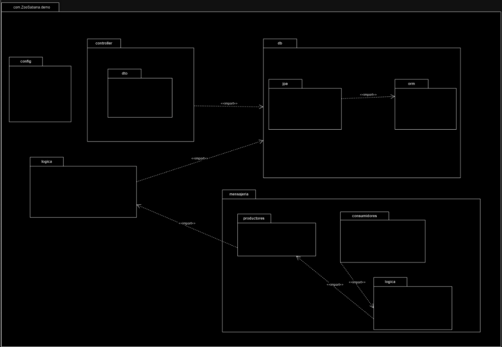

# Trabajo Final de Diseño y Arquitectura de Software

## Integrantes
+ Juan David Cetina Gomez
+ Juliana Isabel Espinel Cortes
+ Ana Lucia Quintero Vargas

## Objetivos
+ Implementar un backend robusto usando Spring Boot para gestionar la lógica de negocio y la persistencia de datos mediante endpoints RESTful.
+ Desarrollar un frontend con React que se conecte con la API para mostrar y manipular datos de manera eficiente.
+ Implementar y configurar tanto el backend como el frontend en Google Cloud Platform, asegurando el acceso y la operación de la aplicación en un entorno de producción.
+ Integración de CI/CD con Jenkins para la solución.
+ Utilizar RabbitMQ para seguir el patrón de arquitectura basado en eventos.

## Diagrama de paquetes

A continuación, se presenta el diagrama de paquetes de la aplicación.

